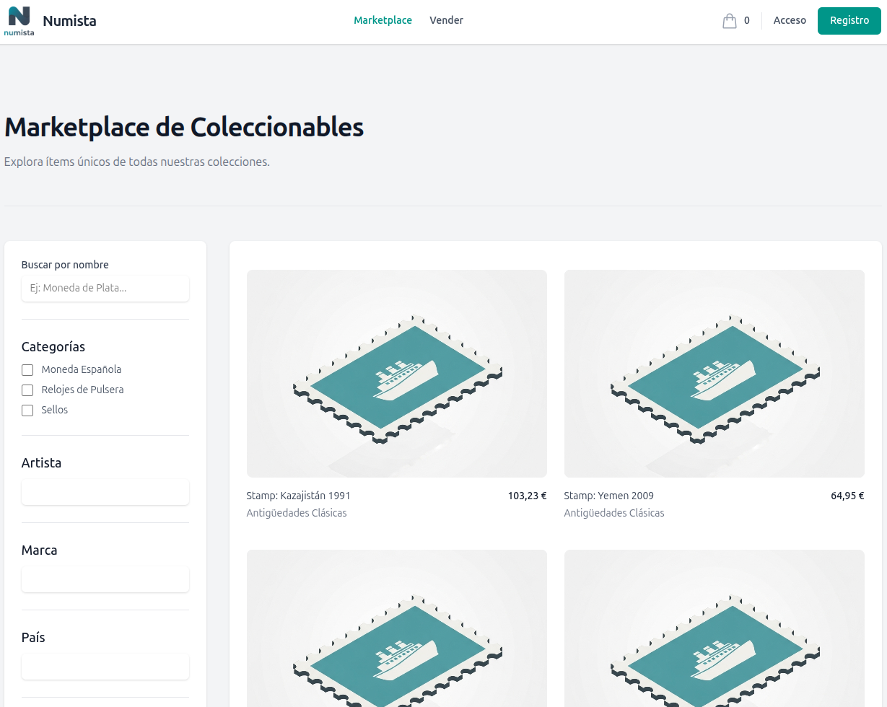
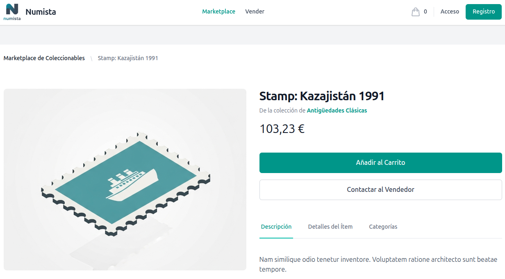
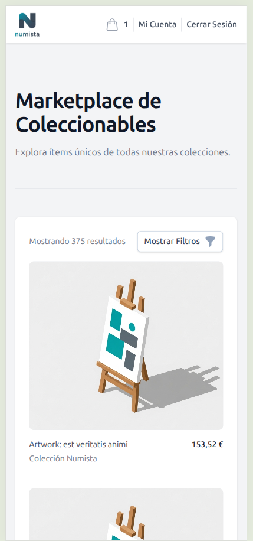

# Numista-App: Numismatics & Collectibles Project

Numista-App is a modern, multi-tenant web application for managing numismatic and other collectible collections. It is built on the TALL stack and containerized with Docker, featuring a powerful admin panel and a fully responsive public marketplace, all structured following Domain-Driven Design (DDD) principles.

---

## ✨ Visual Showcase

| Marketplace (Desktop) | Item Details (Desktop) |
| :---: | :---: |
|  |  |

| Cart Page (Desktop) | Mobile View |
| :---: | :---: |
|  |  |

---

## 🚀 Key Features

### Admin Panel (Filament)
- **Multi-Tenant Architecture:** Each user manages their own isolated collection, with the ability to be part of multiple tenants.
- **Dynamic EAV System:** A flexible Entity-Attribute-Value model allows admins to define custom attributes (e.g., "Year", "Grade", "Composition") for different item types without code changes.
- **Dynamic Forms:** Item forms in Filament are generated dynamically based on the selected "Item Type," displaying only relevant attributes.
- **Complete CRUD Management:** Full create, read, update, and delete functionality for Items, Categories, Collections, Orders, and Attributes.
- **Interactive Dashboard:** A real-time dashboard with widgets for key statistics, charts, and recently added items.
- **Advanced Image Management:** Easy image uploads with reordering and the ability to set a "featured" image, all stored securely in tenant-specific private directories.

### Public Marketplace & E-commerce
- **Fully Responsive Design:** A modern interface built with Tailwind CSS that looks great on all devices.
- **Advanced Filtering:** Users can filter items by search term, category, and any custom, filterable attribute.
- **Full E-commerce Flow:** Includes a seamless shopping cart, a secure checkout process, and a user account section.
- **User Accounts & Order History:** Customers can register, log in, manage their shipping addresses, update their profile, reset their password, and view their complete order history.
- **Event-Driven Notifications:** Uses Domain Events (`OrderPlaced`) to asynchronously handle post-order logic like sending confirmation emails and updating item statuses, ensuring a fast user experience.

---

## 🛠️ Tech Stack

- **Backend**: Laravel 12 & PHP 8.2
- **Frontend**: Livewire 3 & Alpine.js
- **UI/Styling**: Tailwind CSS
- **Admin Panel**: Filament 3
- **Database**: PostgreSQL 16
- **Testing**: Pest (PHPUnit) with automated CI via GitHub Actions.
- **Local Environment**: Docker & Docker Compose
- **Local Email Testing**: Mailpit

---

## 🐳 Local Development Setup

### Prerequisites

- [Docker](https://www.docker.com/products/docker-desktop)
- [Make](https://www.gnu.org/software/make/) (usually pre-installed on Linux/macOS, available for Windows via Chocolatey or WSL)

### 1. Clone the Repository

```bash
git clone <your-repository-url>
cd numista-app
```

### 2. Configure Environment Files

First, copy the Laravel example environment file. The default values are already configured for Docker.
```bash
cp .env.example .env
```
*Note: Ensure `APP_URL=http://localhost:8080`, `DB_HOST=db`, and the Mailpit settings are correctly configured.*

Second, to avoid file permission issues within Docker, create a `.env` file at the project root (this one is for Docker Compose, not Laravel) to set your local user ID.
*On Linux/macOS:*
```bash
echo "UID=$(id -u)" > .env
```
*On Windows, you may need to create the `.env` file manually and set `UID=1000`.*

### 3. Build and Run the Application

The entire setup process is automated with `make`.

```bash
# 1. Build and start all services (app, nginx, db, mailpit) in detached mode
make up

# 2. Run the automated setup script (installs dependencies, migrates & seeds DB)
make setup
```

The application will be available at **[http://localhost:8080](http://localhost:8080)**.
-   **Admin User:** `admin@numista.es`
-   **Password:** `admin`
-   **Mailpit Web UI:** [http://localhost:8025](http://localhost:8025) (to view outgoing emails)

---

## 🏛️ Project Architecture (Domain-Driven Design)

The project is structured following DDD principles to ensure a clear separation of concerns and a scalable codebase.

-   **`src/Collection/Domain`**: The core of the application. Contains the business logic, entities (Eloquent Models), and **Domain Events** (e.g., `OrderPlaced`). This layer is framework-agnostic.
-   **`src/Collection/Application`**: Contains the **Application Services** that orchestrate the use cases (e.g., `PlaceOrderService`) and **Listeners** that react to domain events. This layer is the bridge between the UI and the Domain.
-   **`src/Collection/Infrastructure`**: Contains implementations of external concerns, such as sending emails (`Mailables`) or interacting with third-party APIs.
-   **`src/Collection/UI`**: The presentation layer. It includes Filament Resources, public-facing Controllers, and Blade components. Its role is to handle HTTP requests/responses and delegate actions to the Application layer.

This structure makes the application more modular, easier to test, and simpler to maintain as it grows.

---

## ✅ Running Tests & CI

The project uses Pest for testing and includes a GitHub Actions workflow for Continuous Integration.

-   `make test`: Run the entire test suite (Unit & Feature).
-   `make fix`: Automatically fix code style issues using Pint.

The CI pipeline automatically runs `pint --test` and `php artisan test` on every push and pull request to the `main` and `development` branches.

---

## 🧰 Useful Make Commands

-   `make up`: Build and start all containers.
-   `make setup`: **Run this after `make up` on a fresh install.**
-   `make down`: Stop and remove all containers, networks, and volumes.
-   `make artisan a="<command>"`: Run any `php artisan` command (e.g., `make artisan a="list"`).
-   `make composer a="<command>"`: Run any `composer` command.
-   `make db-shell`: Connect to the PostgreSQL database shell.
-   `make clear-all`: Clear all Laravel application caches.
-   `make fix-permissions`: Fix file permissions for `storage` and `bootstrap/cache`.
-   `make help`: Show all available commands.