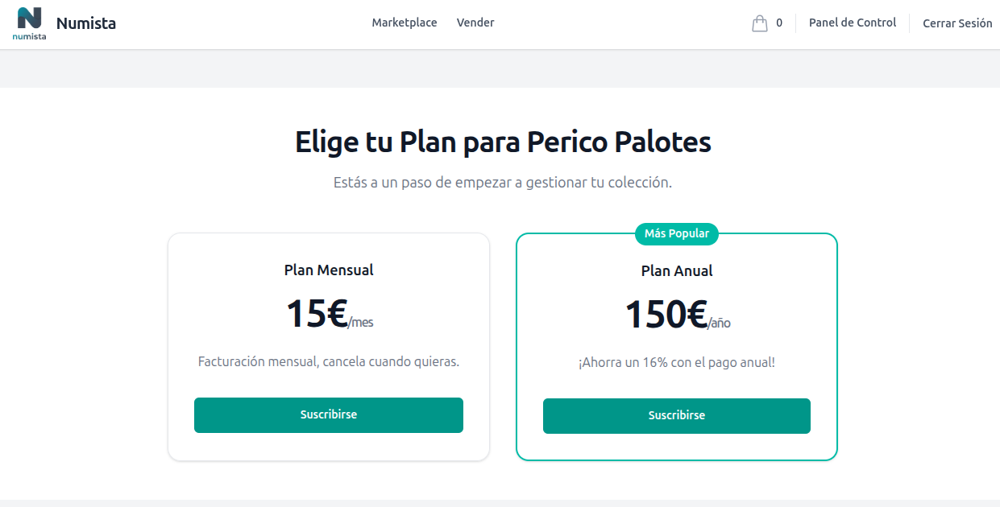
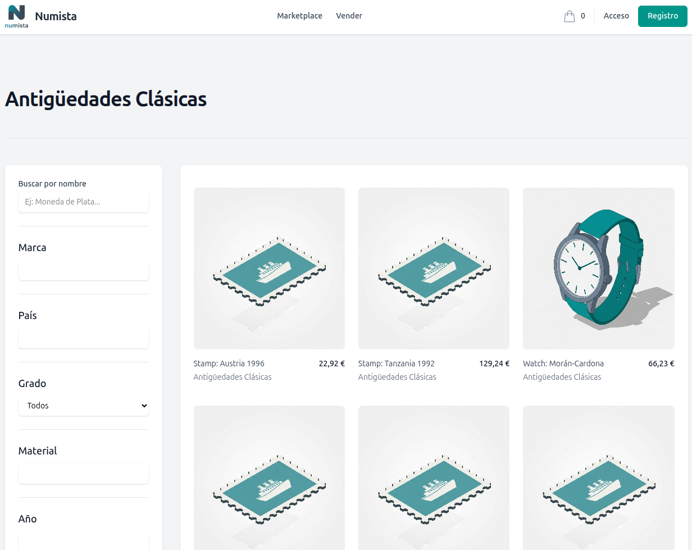

# Numista-App: Collectibles Management & SaaS Marketplace

Numista-App is a modern, multi-tenant SaaS platform for managing and selling numismatic and other collectible collections. Built on the TALL stack (Tailwind, Alpine.js, Livewire, Laravel) and containerized with Docker, the application features a powerful global admin panel, a subscription-based system for sellers (tenants), and a fully responsive public marketplace, all structured following Domain-Driven Design (DDD) principles.

---

## ✨ Image Gallery

| Marketplace (Desktop) | Item Details (Desktop) |
| :---: | :---: |
|  |  |

| Subscription Page | Tenant's Public Profile |
| :---: | :---: |
|  |  |


---

## 🚀 Key Features

### Admin Panel (Filament)
- **Multi-Tenant Architecture:** Each seller (tenant) manages their own isolated collection data (items, orders, etc.).
- **Global Attribute & Category System:** A platform-wide, administrator-managed system for attributes (EAV) and categories ensures data consistency across all tenants.
- **Dynamic Forms:** Item creation forms are dynamically generated based on the selected "Item Type," displaying only relevant, globally-defined attributes.
- **Secure Subscription & Payment System (Stripe Billing & Checkout):**
  - Tenants must subscribe to a monthly or yearly plan to access the panel.
  - Automated subscription management via Stripe Webhooks (`checkout.session.completed`).
- **Access Control:** A dedicated middleware protects the tenant panel, denying access until a subscription is active.
- **Complete CRUD Management:** Full functionality for platform admins to manage global settings and for tenants to manage their own Items, Collections, etc.

### Public Marketplace & E-commerce
- **Dedicated Seller Onboarding:** A public registration flow for new sellers to create an account and their first collection, leading directly to the subscription page.
- **Tenant Profile Pages:** Each tenant has a public-facing page (`/{tenant:slug}`) showcasing all their items for sale.
- **Advanced Filtering:** Users can filter items globally by search term, category, and any custom attribute defined as "filterable."
- **Secure Payments with Stripe:** A complete e-commerce flow, from cart to checkout, with payments processed securely by Stripe Elements.
- **Multi-Tenant Orders:** The cart intelligently splits orders, creating separate orders for each tenant if items from multiple sellers are purchased in a single transaction.
- **Asynchronous Notifications:** Domain Events (`OrderPlaced`, `SubscriptionActivated`, `Registered`) handle post-action tasks (confirmation emails, welcome emails, stock updates, seller notifications) asynchronously via queues.

---

## 🛠️ Tech Stack

- **Backend**: Laravel 12 & PHP 8.2
- **Frontend**: Livewire 3 & Alpine.js
- **UI/Styling**: Tailwind CSS
- **Admin Panel**: Filament 3
- **Database**: PostgreSQL 16
- **Payments & Subscriptions**: Stripe Billing & Checkout
- **Testing**: Pest (PHPUnit)
- **Local Environment**: Docker & Docker Compose with a custom `Makefile`
- **Background Jobs**: Laravel Queues with Supervisor
- **Email Testing**: Mailpit
- **Webhook Tunneling**: Stripe CLI (managed via Supervisor in Docker)

---

## 🐳 Local Development Setup

### Prerequisites

- [Docker](https://www.docker.com/products/docker-desktop)
- [Make](https://www.gnu.org/software/make/) (pre-installed on Linux/macOS, available on Windows via Chocolatey or WSL)

### 1. Stripe Account Setup
- Create a free developer account at [Stripe](https://dashboard.stripe.com/register).
- Make sure you are in **"Test mode"**.
- Go to the **Products** section and create a new product (e.g., "Numista Pro Subscription").
- Add two recurring **Prices** to this product: one monthly and one yearly.
- Note down the **API ID** for each price (they start with `price_...`).

### 2. Environment File Setup
- **Laravel `.env`:** Copy `.env.example` to `.env`. The default database and mail settings are pre-configured for Docker.
- **Docker `.env`:** To avoid file permission issues, create a `.env` file in the project root (for Docker Compose) with your user ID.
  - On Linux/macOS: `echo "UID=$(id -u)" > .env`
  - On Windows: Create the file manually and set `UID=1000`.
- **Stripe Keys:** Add your Stripe keys and the Price IDs you just created to your main Laravel `.env` file.
  ```dotenv
  STRIPE_KEY=pk_test_...
  STRIPE_SECRET=sk_test_...
  STRIPE_PRICE_ID_MONTHLY=price_...
  STRIPE_PRICE_ID_YEARLY=price_...
  ```

### 3. Build and Run the Application
The entire process is automated with `make`.

```bash
# 1. Build and start all services (app, nginx, db, mailpit) in the background.
make up

# 2. Set up the Stripe Webhook
#    - View the logs of the app container to find the webhook secret.
make logs

#    - In the logs, find a line like:
#      "Ready! Your webhook signing secret is whsec_..."
#    - Copy this `whsec_...` value.
#    - Add it to your main Laravel .env file:
STRIPE_WEBHOOK_SECRET=whsec_...

# 3. Run the automated setup script.
#    (Installs dependencies, generates key, clears caches, migrates & seeds the DB)
make setup
```

The application will be available at **[http://localhost:8080](http://localhost:8080)**.
- **Mailpit Web UI:** [http://localhost:8025](http://localhost:8025)

---

## 📖 User Manual

### For Sellers (Tenants)

1.  **Register as a Seller**: Go to the homepage and click the **"Sell"** link. Fill out the form with your collection/store name and your user details.
2.  **Choose Your Subscription**: After registration, you will be redirected to a page to choose your subscription plan (monthly or yearly).
3.  **Make the Payment**: You will be taken to Stripe's secure checkout gateway to activate your account.
4.  **Access Your Panel**: Once the subscription is paid, you will receive a confirmation email and will be able to access your admin panel. Here you can:
    -   **Manage Your Inventory**: Add, edit, and delete items. When creating an item, you will select an "Item Type," and the form will dynamically display the relevant attributes (Year, Grade, Material, etc.).
    -   **Upload Images**: Each item has a gallery where you can upload multiple images, reorder them, and set one as "featured".
    -   **Organize in Collections**: Create themed collections (e.g., "Roman Coins") to group your items.
    -   **View Orders**: When a customer purchases one of your products, you will receive an email notification and can view the order details in the "Orders" section.

### For Buyers (Customers)

1.  **Explore the Marketplace**: Browse all available products from all sellers.
2.  **Use the Filters**: In the sidebar, you can search by name or filter by specific attributes (Country, Brand, Grade, etc.) and global categories to find exactly what you're looking for.
3.  **Discover Sellers**: On a product detail page, you can click the seller's name to visit their profile and see all the items they have for sale.
4.  **Contact the Seller**: If you have questions about a product, use the "Contact Seller" button on the detail page to send a direct message.
5.  **Shop Securely**: Add products to your cart. The checkout process is handled via Stripe, ensuring your data's security. If you purchase from multiple sellers, the system will manage the orders separately.
6.  **Manage Your Account**: In the "My Account" section, you can:
    -   View your order history.
    -   Manage your shipping addresses.
    -   Update your profile information and password.

### For the Platform Administrator

-   **Global Management**: Key entities like **Attributes** and **Categories** are global. They are managed from the **"Settings"** section of the admin panel and apply to all tenants. This ensures data consistency across the marketplace.
-   **Tenant View**: As a super-administrator, you can switch between different tenants from the top dropdown menu to view and manage their specific resources (items, orders, etc.) if needed.

---

## ✅ Testing and Code Quality

-   `make test`: Runs the entire test suite (Unit & Feature).
-   `make fix`: Automatically formats the code using Laravel Pint.
-   `make test-snapshots-update`: Updates Blade/HTML snapshots if UI changes are intentional.