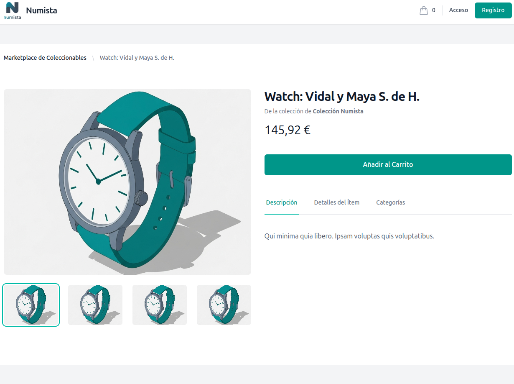

# Numista-App: Collectibles Management & Marketplace

Numista-App is a modern, multi-tenant web application designed for managing numismatic and other collectible collections. Built on the TALL stack (Tailwind, Alpine.js, Livewire, Laravel) and containerized with Docker, the application features a powerful admin panel and a fully responsive public marketplace, all structured following Domain-Driven Design (DDD) principles.

---

## ✨ Image Gallery

| Marketplace (Desktop) | Item Details (Desktop) |
| :---: | :---: |
|  |  |

| Shopping Cart (Desktop) | Responsive View (Mobile) |
| :---: | :---: |
|  |  |

---

## 🚀 Key Features

### Admin Panel (Filament)
- **Multi-Tenant Architecture:** Each user or entity manages their own isolated collection, with the ability to belong to multiple tenants.
- **Dynamic Attribute System (EAV):** A flexible Entity-Attribute-Value model allows administrators to define custom attributes (e.g., "Year", "Grade", "Composition") for different item types.
- **Dynamic Forms:** Item creation and editing forms are dynamically generated based on the selected "Item Type," displaying only relevant fields.
- **Complete CRUD Management:** Full functionality to create, read, update, and delete Items, Categories, Collections, and Attributes.
- **Interactive Dashboard:** A dashboard with widgets displaying key statistics, charts, and recently added items.
- **Advanced Image Management:** Image uploads with an editor, reordering capabilities, and the ability to set a "featured" image. Files are securely stored in private, tenant-specific directories.

### Public Marketplace & E-commerce
- **Dynamic Landing Page:** An attractive homepage showcasing featured collections and the latest items for sale.
- **Fully Responsive Design:** A modern interface built with Tailwind CSS that adapts to any device.
- **"Load More" Pagination:** A smooth user experience for browsing the product catalog without full page reloads.
- **Advanced Filtering:** Users can filter items by search term, category, and any custom attribute defined as "filterable."
- **Complete E-commerce Flow:** Includes a shopping cart, a secure checkout process, and a comprehensive customer account area.
- **User Accounts & Order History:** Customers can register, log in, manage addresses, update their profile, reset their password, and view their order history.
- **Asynchronous Notifications:** Utilizes Domain Events (`OrderPlaced`) to handle post-order tasks (confirmation emails, stock updates) asynchronously via queues.

---

## 🛠️ Tech Stack

- **Backend**: Laravel 12 & PHP 8.2
- **Frontend**: Livewire 3 & Alpine.js
- **UI/Styling**: Tailwind CSS
- **Admin Panel**: Filament 3
- **Database**: PostgreSQL 16
- **Testing**: Pest (PHPUnit)
- **Local Environment**: Docker & Docker Compose
- **Email Testing**: Mailpit

---

## 🐳 Local Development Setup

### Prerequisites

- [Docker](https://www.docker.com/products/docker-desktop)
- [Make](https://www.gnu.org/software/make/) (pre-installed on Linux/macOS, available on Windows via Chocolatey or WSL)

### 1. Clone the Repository

```bash
git clone <your-repository-url>
cd numista-app
```

### 2. Configure Environment Files

First, copy the Laravel example environment file. The default values are pre-configured for Docker.
```bash
cp .env.example .env
```
*Note: Ensure `APP_URL=http://localhost:8080`, `DB_HOST=db`, and the Mailpit settings are correct.*

Second, to avoid file permission issues within Docker, create a `.env` file in the project root (this one is for Docker Compose, not Laravel) to set your local user ID.
*On Linux/macOS:*
```bash
echo "UID=$(id -u)" > .env
```
*On Windows, you may need to create the `.env` file manually and set `UID=1000`.*

### 3. Build and Run the Application

The entire process is automated with `make`.

```bash
# 1. Build and start all services (app, nginx, db, mailpit) in the background.
make up

# 2. Run the automated setup script.
# (Installs dependencies, generates the key, migrates & seeds the DB, and optimizes the app)
make setup
```

The application will be available at **[http://localhost:8080](http://localhost:8080)**.
-   **Admin User:** `admin@numista.es`
-   **Password:** `admin`
-   **Mailpit Web UI:** [http://localhost:8025](http://localhost:8025) (for viewing outgoing emails)

---

## 🏛️ Project Architecture (Domain-Driven Design)

The project is structured following DDD principles to ensure a clear separation of concerns and a scalable codebase.

-   **`src/Collection/Domain`**: The core of the application. Contains the business logic, entities (Eloquent Models), and **Domain Events** (e.g., `OrderPlaced`). This layer is framework-agnostic.
-   **`src/Collection/Application`**: Contains the **Application Services** that orchestrate use cases (e.g., `PlaceOrderService`) and **Listeners** that react to domain events. It bridges the UI and Domain layers.
-   **`src/Collection/Infrastructure`**: Contains implementations of external services, such as sending emails (`Mailables`).
-   **`src/Collection/UI`**: The presentation layer. It includes Filament Resources, public-facing Controllers, Form Requests, and Blade Components.

This structure makes the application more modular, testable, and maintainable.

---

## ✅ Testing and Code Quality

The project uses Pest for testing.

-   `make test`: Runs the entire test suite (Unit & Feature).
-   `make fix`: Automatically formats the code using Laravel Pint.

### Snapshot Testing

This project uses snapshot tests to verify the HTML structure of the public-facing Blade views. These tests ensure that UI changes are intentional.

-   **If a snapshot test fails:** This usually means you have intentionally changed a Blade view. This is expected.
-   **How to update snapshots:** After verifying your changes are correct, run the following command to update the saved snapshots with the new version:
    ```bash
    make test-snapshots-update
    ```
-   **Important:** After updating, you must commit the changed snapshot files (located in `tests/__snapshots__/`) along with your other code changes.

---

## 🧰 Useful Make Commands

-   `make up`: Build and start all containers.
-   `make setup`: **Run this after `up` on a fresh install.**
-   `make down`: Stop and remove all containers and volumes.
-   `make artisan a="<command>"`: Run any `php artisan` command (e.g., `make artisan a="list"`).
-   `make composer a="<command>"`: Run any `composer` command.
-   `make db-shell`: Connect to the PostgreSQL console.
-   `make clear-all`: Clear all application caches.
-   `make help`: Show all available commands.